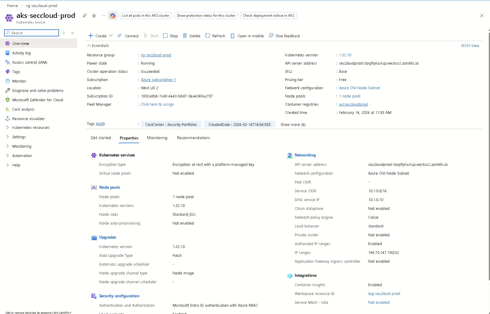
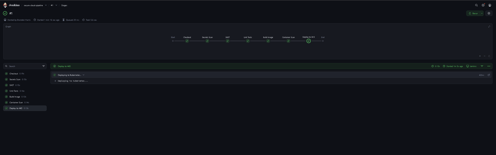
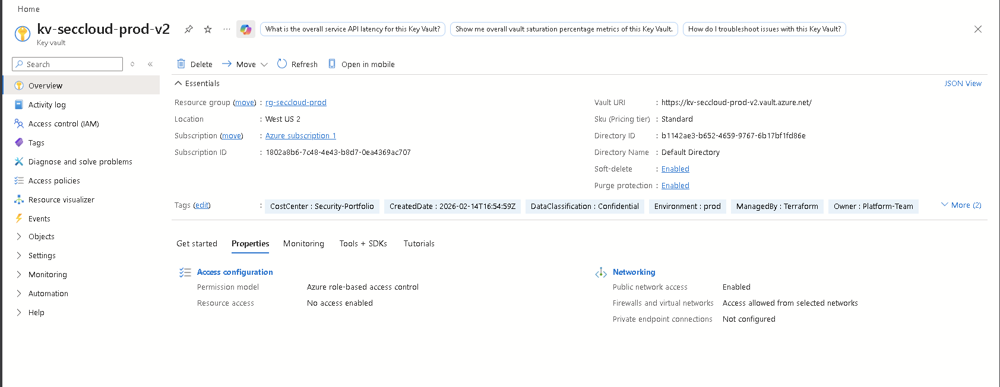

# Secure Cloud Platform

A production-grade cloud infrastructure platform built on Microsoft Azure,
demonstrating enterprise security architecture, Infrastructure as Code,
DevSecOps, and full-stack observability.


---

## What This Demonstrates

This project is an end-to-end reference implementation of a secure, observable,
production-ready cloud platform. It is not a tutorial — every component reflects
a deliberate architectural decision.

| Capability | Implementation |
|---|---|
| Zero-trust networking | Default-deny NetworkPolicies across all namespaces |
| Defense in depth | Security controls at network, identity, container, and CI/CD layers |
| DevSecOps | Security gates block every pipeline stage — not just deployment |
| Full observability | Prometheus + Grafana + Alertmanager with auto-provisioned dashboards |
| Infrastructure as Code | 71 Azure resources, all Kubernetes manifests, all pipeline config |
| Compliance-ready | PCI-DSS, SOC 2, HIPAA control mapping |

---

## Architecture

```
                           ┌─────────────┐
                           │   INTERNET  │
                           └──────┬──────┘
                                  │
┌─────────────────────────────────┼──────────────────────────────────────┐
│                        AZURE (West US 2)                               │
│                                 │                                      │
│  ┌──────────────────────────────┼──────────────────────────────────┐   │
│  │           VIRTUAL NETWORK (10.0.0.0/16)                        │   │
│  │                              │                                  │   │
│  │  ┌────────────────┐          │       ┌──────────────────────┐   │   │
│  │  │ APP GATEWAY    │          │       │    AKS CLUSTER       │   │   │
│  │  │ WAF v2         │──────────┼──────▶│                      │   │   │
│  │  └────────────────┘          │       │  ┌────────────────┐  │   │   │
│  │                              │       │  │  secure-app ns │  │   │   │
│  │  ┌────────────────┐          │       │  │  Flask API x2  │  │   │   │
│  │  │ JENKINS VM     │──────────┼──────▶│  └────────────────┘  │   │   │
│  │  │ CI/CD Pipeline │          │       │  ┌────────────────┐  │   │   │
│  │  └────────────────┘          │       │  │  monitoring ns │  │   │   │
│  │                              │       │  │  Prometheus    │  │   │   │
│  └──────────────────────────────┼───────│  │  Grafana       │  │   │   │
│                                 │       │  │  Alertmanager  │──┘   │   │
│  ┌──────────┐  ┌─────────────┐  │       │  │  node-exporter │      │   │
│  │ KEY VAULT│  │  AZURE SQL  │  │       │  │  kube-state-m  │      │   │
│  │ Secrets  │  │  Database   │  │       │  └────────────────┘      │   │
│  └──────────┘  └─────────────┘  │       └──────────────────────────┘   │
│                                 │                                      │
│  ┌──────────┐  ┌─────────────┐  │                                      │
│  │   ACR    │  │    LOG      │  │                                      │
│  │ Registry │  │  ANALYTICS  │  │                                      │
│  └──────────┘  └─────────────┘  │                                      │
└─────────────────────────────────┴──────────────────────────────────────┘
```

### Deployed Resources — 71 Total

| Category | Resources |
|---|---|
| **Compute** | AKS Cluster (2 nodes), Jenkins VM |
| **Networking** | VNet, 5 Subnets, 5 NSGs, Application Gateway WAF |
| **Data** | Azure SQL Database, Azure Key Vault |
| **Containers** | Container Registry, Flask API (x2 pods) |
| **Monitoring** | Prometheus, Grafana, Alertmanager, kube-state-metrics, node-exporter |
| **Security** | Managed Identities, RBAC Role Assignments, Network Policies |

---

## Security Architecture

### Defense in Depth

```
Layer               Control
─────────────────────────────────────────────────────────────
Network             NSGs + Kubernetes NetworkPolicies (default-deny)
                    Application Gateway WAF
                    Private endpoints for PaaS services

Identity            Azure Managed Identity (no stored credentials)
                    Azure AD RBAC + Kubernetes RBAC
                    Workload Identity for pod-level access

Container           Non-root execution (UID 65534 / 472)
                    Read-only root filesystem
                    All Linux capabilities dropped
                    Pod Security Standards (baseline / restricted)

Application         Security response headers (CSP, HSTS, X-Frame)
                    Rate limiting at ingress
                    Input validation

Data                TDE encryption at rest
                    TLS 1.2+ in transit
                    Key Vault for all secrets (no plaintext)

CI/CD               Secrets scanning (gitleaks) — blocks on detect
                    SAST (bandit) — blocks on HIGH severity
                    Dependency audit (pip-audit)
                    Container scanning (Trivy) — blocks on CRITICAL/HIGH
```

### Threat Model

| Threat | Mitigation |
|---|---|
| SQL Injection | Parameterized queries, WAF rules, input validation |
| Container Escape | Non-root, read-only FS, dropped capabilities |
| Lateral Movement | Default-deny NetworkPolicies, namespace isolation |
| Credential Theft | Managed Identity, Key Vault, no stored secrets |
| Supply Chain | Trivy image scan, pip-audit, pinned image digests |
| Brute Force | Rate limiting (ingress), auth failure alerting |
| Cryptomining / DoS | CPU/memory limits, HPA, Prometheus alerts |

---

## Observability Stack

Full Prometheus + Grafana + Alertmanager deployment in a dedicated
`monitoring` namespace with its own zero-trust network policies.

### Components

| Component | Version | Role |
|---|---|---|
| Prometheus | v2.48.0 | Metrics collection and storage (15-day TSDB) |
| Grafana | v10.2.2 | Visualization — auto-provisioned dashboards |
| Alertmanager | v0.26.0 | Alert routing (critical → webhook, warning → email) |
| kube-state-metrics | v2.10.1 | Kubernetes object state metrics |
| node-exporter | v1.7.0 | Host-level hardware and OS metrics |

### Security Dashboard Panels

- Request rate (req/s) — traffic baseline and anomaly detection
- Error rate (%) — application health, attack indicator
- P95 / P99 response time — performance and DoS detection
- Auth failure rate — brute force indicator
- Pod restarts — crash loop / exploitation indicator
- CPU / memory utilization — cryptomining / resource exhaustion
- Active pods by namespace — deployment visibility

### Alert Routing

```
Alert fires
    │
    ├── severity=critical ──→ PagerDuty webhook (immediate, 1h repeat)
    │
    ├── severity=warning  ──→ Email (1m group wait, 8h repeat)
    │
    └── (inhibition rule) ──→ critical silences duplicate warnings
                               for same alertname + namespace
```

---

## CI/CD Pipeline

11-stage Jenkins DevSecOps pipeline — security gates run on every branch,
deployment runs on `main` only.

```
  Every branch / PR
  ┌──────────┐   ┌──────────┐   ┌──────┐   ┌───────┐   ┌───────┐
  │ Checkout │──▶│ Secrets  │──▶│ SAST │──▶│ Tests │──▶│ Build │
  └──────────┘   │   Scan   │   │      │   │       │   │ Image │
                 └──────────┘   └──────┘   └───────┘   └───┬───┘
                      │              │                      │
                   BLOCKS         BLOCKS                    ▼
                  on leak       on HIGH               ┌───────────┐
                                severity              │   Image   │
                                                      │   Scan    │
                                                      └─────┬─────┘
                                                            │
                                                         BLOCKS
                                                        on CRIT/HIGH
                                                            │
                                                            ▼
                                                      ┌───────────┐
                                                      │ Push ACR  │
                                                      └─────┬─────┘
                                                            │
  ┌─────────────────────┐   ┌──────────────────────┐        │
  │  Validate K8s       │──▶│  Validate Monitoring  │◀───────┘
  │  Manifests (kubeval)│   │  Configs  (kubeval)   │
  └─────────────────────┘   └──────────┬────────────┘

  main only
       │
       ▼
  ┌──────────────────────────────────────────┐
  │  Deploy to AKS                           │
  │                                          │
  │  App stack (k8s/)                        │
  │  namespace → secrets → service →         │
  │  deployment → hpa → ingress              │
  │                                          │
  │  Monitoring stack (monitoring/)          │
  │  namespace → pvcs → alertmanager →       │
  │  kube-state-metrics → node-exporter →    │
  │  grafana configs → prometheus →          │
  │  grafana → networkpolicies → ingress     │
  └──────────────────────────────────────────┘
       │
       ▼
  ┌──────────────┐
  │  Smoke Tests │
  └──────────────┘
```

---

## Live Demo

### AKS Portal


*AKS cluster running Kubernetes 1.32 with Azure CNI networking and Calico network policies*

### Jenkins Pipeline


*11-stage DevSecOps pipeline with security gates at every step*

### Azure Key Vault


*Secrets management with Azure RBAC, soft-delete, and purge protection enabled*

### API Endpoints

| Endpoint | Method | Description |
|---|---|---|
| `/health` | GET | Liveness probe |
| `/ready` | GET | Readiness probe |
| `/metrics` | GET | Prometheus metrics |
| `/api/v1/status` | GET | Application status |
| `/api/v1/echo` | POST | Echo endpoint |

```bash
$ curl http://4.154.192.151/api/v1/status

{
  "status": "operational",
  "environment": "production",
  "timestamp": "2026-02-17T21:01:56.111592",
  "security": {
    "headers_validated": true,
    "tls_enabled": false
  }
}
```

---

## Project Structure

```
secure-cloud-platform/
├── terraform/                  # 71 Azure resources as code
│   └── modules/
│       ├── networking/         # VNet, subnets, NSGs
│       ├── aks/                # Kubernetes cluster
│       ├── acr/                # Container registry
│       ├── sql/                # Database
│       ├── keyvault/           # Secrets management
│       ├── appgateway/         # WAF + load balancing
│       └── jenkins/            # CI/CD server
├── app/                        # Flask API (metrics source)
│   ├── app.py
│   ├── Dockerfile
│   └── requirements.txt
├── k8s/                        # Application manifests
│   ├── namespace.yaml          # PSS restricted
│   ├── deployment.yaml
│   ├── service.yaml
│   ├── networkpolicy.yaml      # Default-deny + allow rules
│   ├── ingress.yaml
│   ├── hpa.yaml
│   └── secrets.yaml
├── monitoring/                 # Full observability stack
│   ├── monitoring-namespace.yaml
│   ├── monitoring-pvc.yaml
│   ├── prometheus-config.yaml
│   ├── prometheus-deployment.yaml
│   ├── grafana-deployment.yaml
│   ├── grafana-provisioning.yaml
│   ├── grafana-security-dashboard.yaml
│   ├── alertmanager-config.yaml
│   ├── alertmanager-deployment.yaml
│   ├── kube-state-metrics.yaml
│   ├── node-exporter.yaml
│   ├── monitoring-networkpolicy.yaml
│   └── monitoring-ingress.yaml
├── jenkins/
│   └── Jenkinsfile             # 11-stage DevSecOps pipeline
└── ansible/
    └── playbooks/
        └── harden-jenkins.yaml
```

---

## Deployment

### Prerequisites

```bash
# Azure CLI + kubectl
winget install Microsoft.AzureCLI
winget install Kubernetes.kubectl

# Authenticate
az login
az aks get-credentials \
  --resource-group rg-seccloud-prod \
  --name aks-seccloud-prod
```

### Infrastructure (Terraform)

```bash
cd terraform
terraform init
terraform plan -out=tfplan
terraform apply tfplan
```

### Application + Monitoring (Jenkins — automated on push to main)

Every merge to `main` triggers the full 11-stage pipeline which deploys
both the application stack and the monitoring stack automatically.

### Manual deploy (if needed)

```bash
kubectl apply -f k8s/
kubectl apply -f monitoring/monitoring-namespace.yaml
kubectl apply -f monitoring/monitoring-pvc.yaml
kubectl apply -f monitoring/alertmanager-config.yaml
kubectl apply -f monitoring/alertmanager-deployment.yaml
kubectl apply -f monitoring/kube-state-metrics.yaml
kubectl apply -f monitoring/node-exporter.yaml
kubectl apply -f monitoring/grafana-provisioning.yaml
kubectl apply -f monitoring/grafana-security-dashboard.yaml
kubectl apply -f monitoring/prometheus-config.yaml
kubectl apply -f monitoring/prometheus-deployment.yaml
kubectl apply -f monitoring/grafana-deployment.yaml
kubectl apply -f monitoring/monitoring-networkpolicy.yaml
kubectl apply -f monitoring/monitoring-ingress.yaml
```

### Access Grafana

```bash
kubectl port-forward svc/grafana 3000:3000 -n monitoring
# Open http://localhost:3000
```

---

## Cost Estimate

| Resource | SKU | Monthly |
|---|---|---|
| AKS (2 nodes) | Standard_B2s | ~$60 |
| Application Gateway | Standard_v2 | ~$180 |
| Azure SQL | S0 | ~$15 |
| Jenkins VM | Standard_B2s | ~$30 |
| Log Analytics | Pay-as-you-go | ~$10 |
| **Total** | | **~$295/month** |

---

## Compliance Coverage

| Framework | Controls Addressed |
|---|---|
| **PCI-DSS** | Network segmentation, encryption, access control, audit logging |
| **SOC 2** | Availability monitoring, access controls, change management |
| **HIPAA** | Encryption at rest/transit, access controls, audit trails |

---

## Technologies

| Category | Stack |
|---|---|
| Cloud | Microsoft Azure |
| IaC | Terraform (71 resources) |
| Containers | Docker, Kubernetes 1.32, containerd |
| CI/CD | Jenkins (11-stage DevSecOps pipeline) |
| Security scanning | gitleaks, bandit, pip-audit, Trivy |
| Observability | Prometheus, Grafana, Alertmanager, kube-state-metrics, node-exporter |
| Application | Python, Flask, Gunicorn |
| Database | Azure SQL |
| Secret management | Azure Key Vault, Managed Identity |
| Policy | Kubernetes NetworkPolicy, Pod Security Standards, OPA/conftest |

---

<p align="center">
  <b>Built with security-first principles for a zero-trust, production-grade cloud environment</b><br><br>
  <a href="#architecture">Architecture</a> •
  <a href="#security-architecture">Security</a> •
  <a href="#observability-stack">Observability</a> •
  <a href="#cicd-pipeline">CI/CD</a> •
  <a href="#live-demo">Demo</a>
</p>
