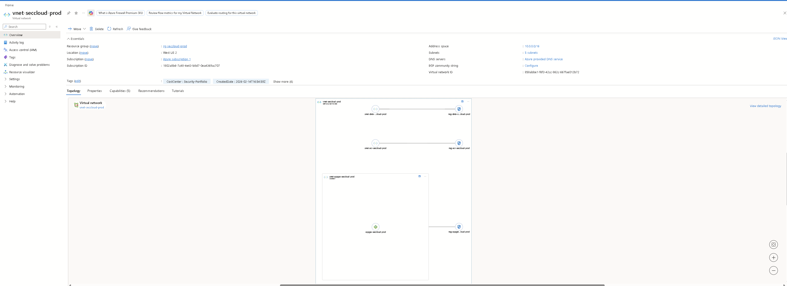
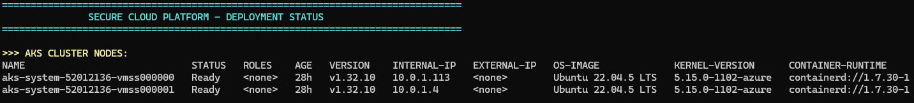
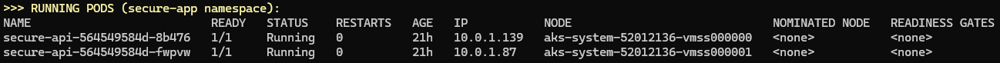
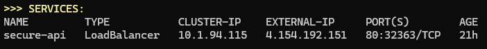
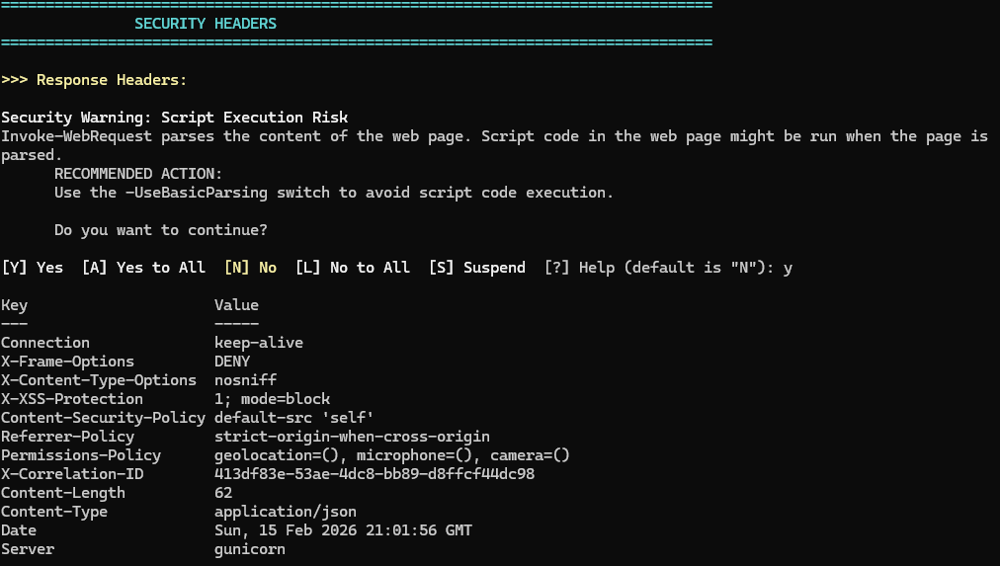
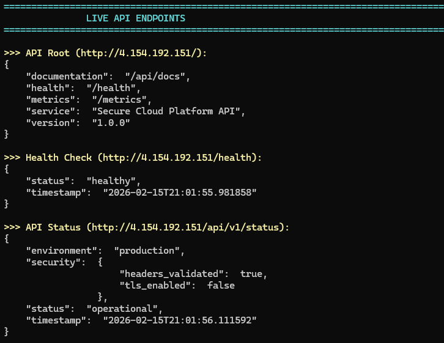

# Secure Cloud Platform

A production-grade cloud infrastructure platform built on Microsoft Azure, demonstrating enterprise security best practices, Infrastructure as Code, and DevSecOps principles.


## Overview

This project implements a complete cloud-native application platform addressing enterprise challenges: **secure cloud deployments, comprehensive observability, Infrastructure as Code, and DevSecOps security.**

### Key Features

- **Zero Trust Architecture** - Network segmentation with deny-all default policies
- **Defense in Depth** - Multiple security controls at network, identity, application, and data layers
- **DevSecOps Pipeline** - Security scanning integrated into every CI/CD stage
- **Comprehensive Monitoring** - Log Analytics and Container Insights for observability
- **Infrastructure as Code** - 71 Azure resources managed with Terraform
- **Container Security** - Hardened containers with non-root execution

## Architecture

```
                              ┌──────────────┐
                              │   INTERNET   │
                              └──────┬───────┘
                                     │
    ┌────────────────────────────────┼───────────────────────────────────────┐
    │                         AZURE (West US 2)                              │
    │                                │                                       │
    │   ┌────────────────────────────┼───────────────────────────────────┐   │
    │   │              VIRTUAL NETWORK (10.0.0.0/16)                     │   │
    │   │                            │                                   │   │
    │   │  ┌─────────────────┐       │      ┌─────────────────────────┐  │   │
    │   │  │ APP GATEWAY     │       │      │      AKS CLUSTER        │  │   │
    │   │  │ (WAF v2)        │       │      │                         │  │   │
    │   │  │                 │       │      │   ┌───────┐ ┌───────┐   │  │   │
    │   │  │ 20.83.248.248   │───────┼─────▶│   │ Pod 1 │ │ Pod 2 │   │  │   │
    │   │  │                 │       │      │   │ :8080 │ │ :8080 │   │  │   │
    │   │  └─────────────────┘       │      │   └───────┘ └───────┘   │  │   │
    │   │                            │      │         │               │  │   │
    │   │  ┌─────────────────┐       │      │   LoadBalancer          │  │   │
    │   │  │ JENKINS VM      │       │      │   4.154.192.151         │  │   │
    │   │  │ 20.3.218.242    │───────┼─────▶└─────────────────────────┘  │   │
    │   │  │ :8080           │       │                                   │   │
    │   │  └─────────────────┘       │                                   │   │
    │   │                            │                                   │   │
    │   └────────────────────────────┼───────────────────────────────────┘   │
    │                                │                                       │
    │   ┌──────────────┐  ┌──────────┴───┐  ┌──────────────┐  ┌───────────┐  │
    │   │  AZURE SQL   │  │  KEY VAULT   │  │     ACR      │  │    LOG    │  │
    │   │  DATABASE    │  │  Secrets     │  │   Registry   │  │ ANALYTICS │  │
    │   └──────────────┘  └──────────────┘  └──────────────┘  └───────────┘  │
    │                                                                        │
    └────────────────────────────────────────────────────────────────────────┘
```

### Network Topology


*Azure Virtual Network with segmented subnets and NSG associations*

### Deployed Resources (71 Total)

| Category | Resources |
|----------|-----------|
| **Compute** | AKS Cluster (2 nodes), Jenkins VM |
| **Networking** | VNet, 5 Subnets, 5 NSGs, Application Gateway |
| **Data** | Azure SQL Database, Key Vault |
| **Containers** | Container Registry, 2 Flask API Pods |
| **Monitoring** | Log Analytics, Container Insights |
| **Security** | Managed Identities, RBAC Role Assignments |

## Infrastructure

### Azure Kubernetes Service (AKS)


*AKS cluster running Kubernetes 1.32 with Azure CNI networking and Calico network policies*

**Cluster Configuration:**
- Kubernetes version: 1.32.10
- Network policy: Calico
- Authentication: Microsoft Entra ID with Azure RBAC
- Container Insights: Enabled
- Encryption: Platform-managed keys

### AKS Cluster Nodes


*Two-node cluster running Ubuntu 22.04 LTS with containerd runtime*

### Running Pods


*Flask API pods distributed across nodes for high availability*

### LoadBalancer Service


*Kubernetes LoadBalancer exposing the API on external IP 4.154.192.151*

## Security

### Security Controls

| Layer | Controls |
|-------|----------|
| **Network** | NSGs with default-deny, network segmentation, private endpoints |
| **Identity** | Managed identities, Azure AD RBAC, workload identity |
| **Application** | Non-root containers, security headers, input validation |
| **Data** | TDE encryption, TLS 1.2+, Key Vault secrets |
| **CI/CD** | SAST, dependency scanning, image scanning, secrets detection |
| **Monitoring** | Prometheus alerts, security dashboards, audit logging |

### Security Headers


*Application implements comprehensive security headers including X-Frame-Options, X-Content-Type-Options, X-XSS-Protection, Content-Security-Policy, and Referrer-Policy*

### Azure Key Vault


*Secrets management with Azure RBAC, soft-delete, and purge protection enabled*

### Threat Model

| Threat | Mitigation |
|--------|------------|
| **SQL Injection** | Parameterized queries, WAF rules, input validation |
| **Container Escape** | Non-root execution, read-only filesystem, dropped capabilities |
| **Lateral Movement** | Network policies, segmented subnets, micro-segmentation |
| **Credential Theft** | Managed identities, Key Vault, no stored secrets |
| **Supply Chain Attack** | Image scanning, dependency audit, signed artifacts |

## CI/CD Pipeline

### Jenkins DevSecOps Pipeline


*Complete DevSecOps pipeline with security scanning at every stage*

**Pipeline Stages:**

```
┌──────────┐ ┌───────────┐ ┌────────┐ ┌───────┐ ┌───────────┐ ┌────────────┐ ┌────────┐
│ Checkout │→│  Secrets  │→│  SAST  │→│ Tests │→│   Build   │→│ Image Scan │→│ Deploy │
│          │ │   Scan    │ │        │ │       │ │   Image   │ │  (Trivy)   │ │ to AKS │
└──────────┘ └───────────┘ └────────┘ └───────┘ └───────────┘ └────────────┘ └────────┘
                 ↓              ↓                                   ↓
              FAIL if       FAIL if                             FAIL if
              secrets       HIGH                              CRITICAL/HIGH
              detected      severity                           CVEs found
```

**Security Gates:**
- **Secrets Scan**: Detects hardcoded credentials, API keys, passwords
- **SAST (Bandit)**: Static analysis for Python security vulnerabilities
- **Dependency Scan**: Checks for vulnerable packages
- **Container Scan (Trivy)**: Scans images for CVEs before deployment

## Live Demo

### API Endpoints


*Live API responses showing healthy status and production environment*

| Endpoint | Method | Description |
|----------|--------|-------------|
| `/` | GET | API information |
| `/health` | GET | Liveness probe |
| `/ready` | GET | Readiness probe |
| `/metrics` | GET | Prometheus metrics |
| `/api/v1/status` | GET | Application status |
| `/api/v1/echo` | POST | Echo endpoint (testing) |

### Example Response

```bash
$ curl http://4.154.192.151/api/v1/status
```

```json
{
  "status": "operational",
  "environment": "production",
  "timestamp": "2026-02-15T21:01:56.111592",
  "security": {
    "headers_validated": true,
    "tls_enabled": false
  }
}
```

## Quick Start

### Prerequisites

- Azure CLI installed and configured
- Terraform >= 1.5.0
- kubectl
- Docker

### Deployment

1. **Clone and configure**
   ```bash
   git clone https://github.com/yourusername/secure-cloud-platform.git
   cd secure-cloud-platform/terraform
   cp terraform.tfvars.example terraform.tfvars
   # Edit terraform.tfvars with your values
   ```

2. **Deploy infrastructure**
   ```bash
   terraform init
   terraform plan -out=tfplan
   terraform apply tfplan
   ```

3. **Configure kubectl**
   ```bash
   az aks get-credentials --resource-group rg-seccloud-prod --name aks-seccloud-prod
   ```

4. **Deploy application**
   ```bash
   kubectl apply -f k8s/
   ```

## Project Structure

```
secure-cloud-platform/
├── terraform/           # Infrastructure as Code
│   ├── modules/         # Terraform modules
│   │   ├── networking/  # VNet, subnets, NSGs
│   │   ├── aks/         # Kubernetes cluster
│   │   ├── acr/         # Container registry
│   │   ├── sql/         # Database
│   │   ├── keyvault/    # Secrets management
│   │   ├── appgateway/  # Application Gateway
│   │   ├── jenkins/     # CI/CD server
│   │   └── monitoring/  # Log Analytics
│   └── main.tf          # Root module
├── app/                 # Flask application
│   ├── app.py           # Main application
│   ├── Dockerfile       # Container definition
│   └── requirements.txt # Python dependencies
├── k8s/                 # Kubernetes manifests
│   ├── deployment.yaml  # Pod deployment
│   ├── service.yaml     # Service definition
│   └── networkpolicy.yaml # Network policies
├── jenkins/             # CI/CD pipeline
│   └── Jenkinsfile      # Pipeline definition
├── images/              # Documentation screenshots
└── docs/                # Documentation
    └── architecture.md  # Architecture details
```

## Quick Commands

```bash
# Get AKS credentials
az aks get-credentials --resource-group rg-seccloud-prod --name aks-seccloud-prod

# View running pods
kubectl get pods -n secure-app

# Check application logs
kubectl logs -l app=secure-api -n secure-app

# Scale deployment
kubectl scale deployment secure-api --replicas=3 -n secure-app

# Login to ACR
az acr login --name acrseccloudprod
```

## Compliance Considerations

This architecture supports compliance with:
- **PCI-DSS** - Network segmentation, encryption, access control
- **SOC 2** - Audit logging, access controls, monitoring
- **HIPAA** - Encryption, access controls, audit trails

## Cost Estimate

| Resource | SKU | Monthly Estimate |
|----------|-----|------------------|
| AKS (2 nodes) | Standard_B2s | ~$60 |
| Application Gateway | Standard_v2 | ~$180 |
| Azure SQL | S0 | ~$15 |
| Jenkins VM | Standard_B2s | ~$30 |
| Log Analytics | Pay-as-you-go | ~$10 |
| **Total** | | **~$295/month** |

## Technologies Used

| Category | Technologies |
|----------|-------------|
| **Cloud** | Microsoft Azure |
| **IaC** | Terraform (71 resources) |
| **Containers** | Docker, Kubernetes 1.32, Helm |
| **CI/CD** | Jenkins |
| **Application** | Python, Flask, Gunicorn |
| **Database** | Azure SQL |
| **Security** | Key Vault, NSGs, Managed Identity, WAF |
| **Monitoring** | Log Analytics, Container Insights |

## Future Enhancements

- [ ] Add HTTPS/TLS with certificates
- [ ] Implement Azure Front Door for global load balancing
- [ ] Add Velero for Kubernetes backup
- [ ] Integrate Azure Defender for container security
- [ ] Add Prometheus/Grafana stack
- [ ] Implement GitOps with Flux or ArgoCD

## Author

**Principal Cloud Security Architect**

This project demonstrates expertise in:
- Cloud Architecture (Azure)
- Infrastructure as Code (Terraform)
- Container Orchestration (Kubernetes)
- DevSecOps (Jenkins, Security Scanning)
- Zero Trust Security Architecture
- Enterprise Security Controls

## License

MIT License - See LICENSE file for details.

---

<p align="center">
  <b>Built with security-first principles</b><br><br>
  <a href="#architecture">Architecture</a> •
  <a href="#security">Security</a> •
  <a href="#cicd-pipeline">CI/CD</a> •
  <a href="#live-demo">Live Demo</a>
</p>
