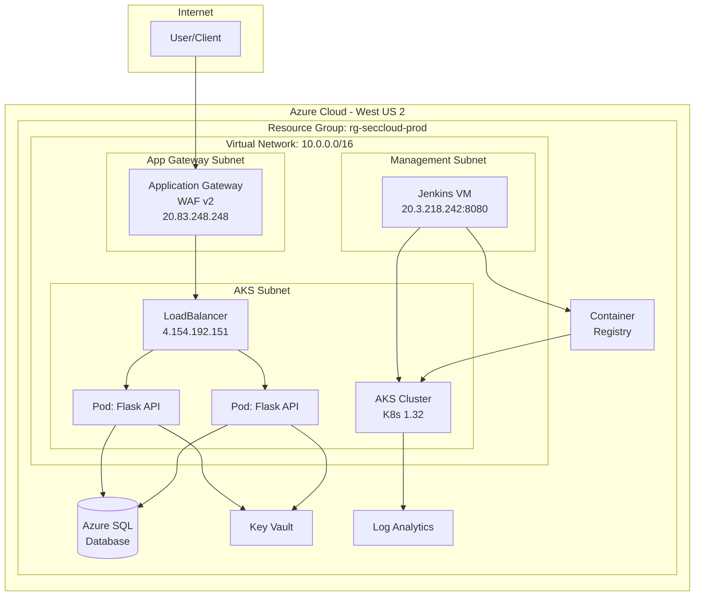

# Secure Cloud Platform - Architecture

## High-Level Architecture Diagram

```
┌─────────────────────────────────────────────────────────────────────────────────────────┐
│                                    INTERNET                                              │
└─────────────────────────────────────────┬───────────────────────────────────────────────┘
                                          │
                                          ▼
┌─────────────────────────────────────────────────────────────────────────────────────────┐
│                              AZURE SUBSCRIPTION                                          │
│                           (West US 2 Region)                                            │
│  ┌───────────────────────────────────────────────────────────────────────────────────┐  │
│  │                         RESOURCE GROUP: rg-seccloud-prod                          │  │
│  │                                                                                   │  │
│  │  ┌─────────────────────────────────────────────────────────────────────────────┐  │  │
│  │  │                    VIRTUAL NETWORK: vnet-seccloud-prod                      │  │  │
│  │  │                         Address Space: 10.0.0.0/16                          │  │  │
│  │  │                                                                             │  │  │
│  │  │  ┌──────────────────┐  ┌──────────────────┐  ┌──────────────────────────┐  │  │  │
│  │  │  │  APP GATEWAY     │  │   AKS SUBNET     │  │    MANAGEMENT SUBNET     │  │  │  │
│  │  │  │  SUBNET          │  │   10.0.1.0/24    │  │      10.0.4.0/24         │  │  │  │
│  │  │  │  10.0.2.0/24     │  │                  │  │                          │  │  │  │
│  │  │  │                  │  │  ┌────────────┐  │  │  ┌────────────────────┐  │  │  │  │
│  │  │  │ ┌──────────────┐ │  │  │ AKS CLUSTER│  │  │  │   JENKINS VM       │  │  │  │  │
│  │  │  │ │ APPLICATION  │ │  │  │            │  │  │  │                    │  │  │  │  │
│  │  │  │ │   GATEWAY    │ │  │  │ ┌────────┐ │  │  │  │  ┌──────────────┐ │  │  │  │  │
│  │  │  │ │              │ │  │  │ │  Pod   │ │  │  │  │  │   Jenkins    │ │  │  │  │  │
│  │  │  │ │  (WAF v2)    │─┼──┼─▶│ │  API   │ │  │  │  │  │   CI/CD      │ │  │  │  │  │
│  │  │  │ │              │ │  │  │ │ :8080  │ │  │  │  │  │   :8080      │ │  │  │  │  │
│  │  │  │ │ Public IP:   │ │  │  │ └────────┘ │  │  │  │  └──────────────┘ │  │  │  │  │
│  │  │  │ │ 20.83.248.248│ │  │  │ ┌────────┐ │  │  │  │                    │  │  │  │  │
│  │  │  │ └──────────────┘ │  │  │ │  Pod   │ │  │  │  │  Public IP:        │  │  │  │  │
│  │  │  │                  │  │  │ │  API   │ │  │  │  │  20.3.218.242      │  │  │  │  │
│  │  │  │  NSG: nsg-appgw  │  │  │ │ :8080  │ │  │  │  └────────────────────┘  │  │  │  │
│  │  │  └──────────────────┘  │  │ └────────┘ │  │  │                          │  │  │  │
│  │  │                        │  │            │  │  │   NSG: nsg-mgmt          │  │  │  │
│  │  │                        │  │ K8s: 1.32  │  │  └──────────────────────────┘  │  │  │
│  │  │                        │  │ 2 Nodes    │  │                                │  │  │
│  │  │                        │  └────────────┘  │                                │  │  │
│  │  │                        │                  │                                │  │  │
│  │  │                        │  LoadBalancer    │                                │  │  │
│  │  │                        │  4.154.192.151   │                                │  │  │
│  │  │                        │                  │                                │  │  │
│  │  │                        │  NSG: nsg-aks    │                                │  │  │
│  │  │                        └──────────────────┘                                │  │  │
│  │  │                                                                             │  │  │
│  │  │  ┌──────────────────┐  ┌──────────────────┐                                │  │  │
│  │  │  │   DATA SUBNET    │  │    ACR SUBNET    │                                │  │  │
│  │  │  │   10.0.3.0/24    │  │   10.0.5.0/24    │                                │  │  │
│  │  │  │                  │  │                  │                                │  │  │
│  │  │  │  (Private        │  │  (Private        │                                │  │  │
│  │  │  │   Endpoints)     │  │   Endpoints)     │                                │  │  │
│  │  │  │                  │  │                  │                                │  │  │
│  │  │  │  NSG: nsg-data   │  │  NSG: nsg-acr    │                                │  │  │
│  │  │  └──────────────────┘  └──────────────────┘                                │  │  │
│  │  │                                                                             │  │  │
│  │  └─────────────────────────────────────────────────────────────────────────────┘  │  │
│  │                                                                                   │  │
│  │  ┌─────────────────────────────────────────────────────────────────────────────┐  │  │
│  │  │                           AZURE SERVICES                                    │  │  │
│  │  │                                                                             │  │  │
│  │  │  ┌─────────────────┐ ┌─────────────────┐ ┌─────────────────┐ ┌───────────┐  │  │  │
│  │  │  │  AZURE SQL      │ │  KEY VAULT      │ │  CONTAINER      │ │   LOG     │  │  │  │
│  │  │  │  DATABASE       │ │                 │ │  REGISTRY       │ │ ANALYTICS │  │  │  │
│  │  │  │                 │ │  kv-seccloud-   │ │                 │ │           │  │  │  │
│  │  │  │ sql-seccloud-   │ │  prod-v2        │ │ acrseccloudprod │ │ log-sec-  │  │  │  │
│  │  │  │ prod            │ │                 │ │                 │ │ cloud-prod│  │  │  │
│  │  │  │                 │ │  Secrets:       │ │ Images:         │ │           │  │  │  │
│  │  │  │ DB: sqldb-      │ │  - DB Conn      │ │ - secure-api    │ │ Container │  │  │  │
│  │  │  │ seccloud-prod   │ │  - API Keys     │ │   :v1.0.0       │ │ Insights  │  │  │  │
│  │  │  │                 │ │  - SSH Keys     │ │                 │ │           │  │  │  │
│  │  │  └─────────────────┘ └─────────────────┘ └─────────────────┘ └───────────┘  │  │  │
│  │  │                                                                             │  │  │
│  │  └─────────────────────────────────────────────────────────────────────────────┘  │  │
│  │                                                                                   │  │
│  └───────────────────────────────────────────────────────────────────────────────────┘  │
│                                                                                         │
└─────────────────────────────────────────────────────────────────────────────────────────┘
```

## CI/CD Pipeline Flow

```
┌─────────────┐    ┌─────────────┐    ┌─────────────┐    ┌─────────────┐    ┌─────────────┐
│   GitHub    │    │   Jenkins   │    │    ACR      │    │    AKS      │    │  Live App   │
│   Repo      │───▶│   CI/CD     │───▶│   Build &   │───▶│  Deploy     │───▶│  Running    │
│             │    │   Pipeline  │    │   Push      │    │             │    │             │
└─────────────┘    └─────────────┘    └─────────────┘    └─────────────┘    └─────────────┘
                          │
                          ▼
              ┌───────────────────────┐
              │   Security Scans      │
              │   - Secrets Scan      │
              │   - SAST (Bandit)     │
              │   - Dependency Scan   │
              │   - Container Scan    │
              └───────────────────────┘
```

## Network Security (Zero Trust)

```
┌────────────────────────────────────────────────────────────────────────────────┐
│                           NETWORK SECURITY GROUPS                               │
├────────────────────────────────────────────────────────────────────────────────┤
│                                                                                 │
│  ┌─────────────────────┐      ┌─────────────────────┐      ┌─────────────────┐ │
│  │   nsg-appgw         │      │   nsg-aks           │      │   nsg-mgmt      │ │
│  │                     │      │                     │      │                 │ │
│  │  ALLOW:             │      │  ALLOW:             │      │  ALLOW:         │ │
│  │  - HTTP (80)        │─────▶│  - AppGW (80/443)   │      │  - SSH (22)     │ │
│  │  - HTTPS (443)      │      │  - VNet Internal    │      │  - Jenkins      │ │
│  │  - Health Probes    │      │  - Load Balancer    │      │    (8080)       │ │
│  │                     │      │                     │      │  - Admin IPs    │ │
│  │  DENY:              │      │  DENY:              │      │                 │ │
│  │  - All Other        │      │  - All Other        │      │  DENY:          │ │
│  └─────────────────────┘      └─────────────────────┘      │  - All Other    │ │
│                                                             └─────────────────┘ │
│                                                                                 │
│  ┌─────────────────────┐      ┌─────────────────────┐                          │
│  │   nsg-data          │      │   nsg-acr           │                          │
│  │                     │      │                     │                          │
│  │  ALLOW:             │      │  ALLOW:             │                          │
│  │  - SQL (1433)       │      │  - ACR (443)        │                          │
│  │  - VNet Only        │      │  - VNet Only        │                          │
│  │                     │      │                     │                          │
│  │  DENY:              │      │  DENY:              │                          │
│  │  - Internet         │      │  - Internet         │                          │
│  └─────────────────────┘      └─────────────────────┘                          │
│                                                                                 │
└────────────────────────────────────────────────────────────────────────────────┘
```

## Data Flow

```
                                    ┌──────────────┐
                                    │    User      │
                                    └──────┬───────┘
                                           │ HTTPS
                                           ▼
                                    ┌──────────────┐
                                    │ Application  │
                                    │   Gateway    │
                                    │   (WAF v2)   │
                                    └──────┬───────┘
                                           │ HTTP/HTTPS
                                           ▼
                                    ┌──────────────┐
                                    │     AKS      │
                                    │  Ingress /   │
                                    │ LoadBalancer │
                                    └──────┬───────┘
                                           │
                          ┌────────────────┼────────────────┐
                          │                │                │
                          ▼                ▼                ▼
                   ┌────────────┐   ┌────────────┐   ┌────────────┐
                   │   Pod 1    │   │   Pod 2    │   │   Pod N    │
                   │ Flask API  │   │ Flask API  │   │ Flask API  │
                   └─────┬──────┘   └─────┬──────┘   └─────┬──────┘
                         │                │                │
                         └────────────────┼────────────────┘
                                          │
                         ┌────────────────┼────────────────┐
                         │                │                │
                         ▼                ▼                ▼
                  ┌────────────┐   ┌────────────┐   ┌────────────┐
                  │  Azure SQL │   │  Key Vault │   │    Log     │
                  │  Database  │   │  (Secrets) │   │  Analytics │
                  └────────────┘   └────────────┘   └────────────┘
```

## Technology Stack

```
┌─────────────────────────────────────────────────────────────────────────────┐
│                           TECHNOLOGY STACK                                   │
├─────────────────────────────────────────────────────────────────────────────┤
│                                                                              │
│  INFRASTRUCTURE          APPLICATION           SECURITY          MONITORING │
│  ───────────────         ───────────           ────────          ────────── │
│                                                                              │
│  ┌─────────────┐         ┌─────────────┐       ┌──────────┐     ┌─────────┐ │
│  │  Terraform  │         │   Python    │       │  Azure   │     │  Azure  │ │
│  │    IaC      │         │   Flask     │       │   RBAC   │     │ Monitor │ │
│  └─────────────┘         └─────────────┘       └──────────┘     └─────────┘ │
│                                                                              │
│  ┌─────────────┐         ┌─────────────┐       ┌──────────┐     ┌─────────┐ │
│  │   Azure     │         │   Gunicorn  │       │   NSGs   │     │   Log   │ │
│  │    AKS      │         │   WSGI      │       │ Zero Trust│    │Analytics│ │
│  └─────────────┘         └─────────────┘       └──────────┘     └─────────┘ │
│                                                                              │
│  ┌─────────────┐         ┌─────────────┐       ┌──────────┐     ┌─────────┐ │
│  │  Kubernetes │         │   Docker    │       │ Managed  │     │Container│ │
│  │   1.32      │         │ Containers  │       │ Identity │     │Insights │ │
│  └─────────────┘         └─────────────┘       └──────────┘     └─────────┘ │
│                                                                              │
│  ┌─────────────┐         ┌─────────────┐       ┌──────────┐     ┌─────────┐ │
│  │   Jenkins   │         │  Azure SQL  │       │   Key    │     │Prometheus│
│  │   CI/CD     │         │  Database   │       │  Vault   │     │ Metrics │ │
│  └─────────────┘         └─────────────┘       └──────────┘     └─────────┘ │
│                                                                              │
└─────────────────────────────────────────────────────────────────────────────┘
```

## Mermaid Diagram (for GitHub/Documentation)



## Resource Summary

| Resource Type | Name | Purpose |
|--------------|------|---------|
| Resource Group | rg-seccloud-prod | Container for all resources |
| Virtual Network | vnet-seccloud-prod | Network isolation |
| AKS Cluster | aks-seccloud-prod | Container orchestration |
| Application Gateway | appgw-seccloud-prod | WAF & Load balancing |
| SQL Server | sql-seccloud-prod | Relational database |
| Key Vault | kv-seccloud-prod-v2 | Secrets management |
| Container Registry | acrseccloudprod | Docker image storage |
| Log Analytics | log-seccloud-prod | Monitoring & logging |
| Jenkins VM | vm-jenkins-seccloud-prod | CI/CD automation |

## Security Controls

| Control | Implementation |
|---------|---------------|
| Network Segmentation | 5 subnets with dedicated NSGs |
| Zero Trust | Deny-all default, explicit allow rules |
| Identity | Managed Identities, Azure RBAC |
| Secrets | Azure Key Vault integration |
| Container Security | Non-root, read-only filesystem |
| Monitoring | Log Analytics, Container Insights |
| WAF | Application Gateway WAF v2 |
| Encryption | TLS in transit, encryption at rest |
